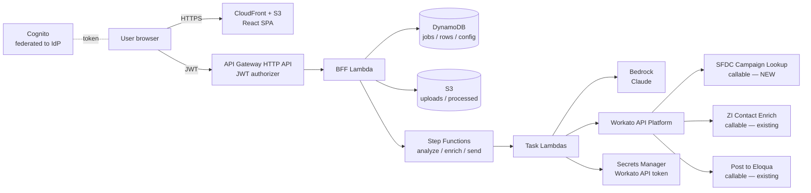
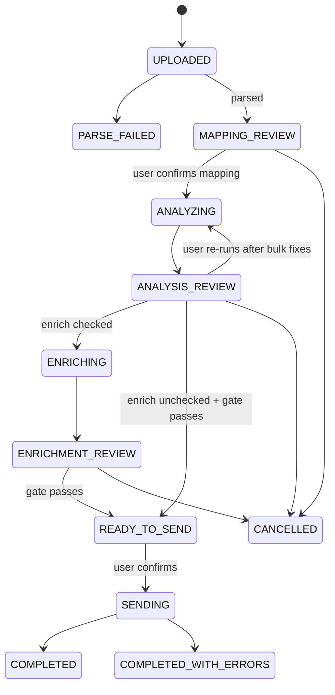

# List Uploader: Build Specification

**Version:** 0.1 (draft) · **Date:** 2026-09-23 · **Owner:** Brandon Farris, Marketing Technology Operations
**Status:** Ready to build Phases 0–3. Phases 4–5 depend on open questions OQ-1 and OQ-9 (§23).

---

## 1. Purpose

Event managers and other marketing users upload lead lists today via a spreadsheet template (`List_Upload_Template_Updated_2026-09-02.xlsx`). The data often doesn't conform: header names vary, picklist values are misspelled, and required values are missing or junk. This app replaces the manual path with a guided, self-service flow:

**upload → map columns → analyze and fix → (optional) enrich → send to Eloqua → confirmation**

The goal is that uploads are trustworthy enough to go to Eloqua **without MOps review**. Every design choice below that adds a gate exists because of that goal.

### In scope (v1)
- CSV and XLSX upload (first data sheet only)
- Deterministic + AI-assisted column mapping with user confirmation
- Normalization using the existing lead normalizer, validation, and AI junk detection
- Per-row Salesforce campaign validation (ID, member status, lead source)
- Optional enrichment via the existing Workato ZoomInfo callable
- Submission via the existing Workato "Post to Eloqua" callable
- Upload history, downloadable processed file, admin-managed Lead Source list

### Out of scope (v1)
- Clay enrichment (the provider interface must allow it later, §15.6)
- Delivery reconciliation (confirming each lead reached Eloqua/SFDC; phase 2, §16.5)
- Editing the source file or writing back to it
- Multi-sheet XLSX, Google Sheets links

---

## 2. Users and roles

| Role | Who | Can |
|---|---|---|
| Uploader | Event managers, campaign managers | Create jobs, map, fix, enrich, send their own jobs; view own history |
| Admin | Marketing Tech Ops | Everything Uploader can, plus: manage Lead Source list, view all jobs, edit thresholds |

Role comes from an IdP group claim mapped in Cognito (OQ-7). The uploader's email comes from the ID token. **There is no free-text email field**; it would be spoofable.

---

## 3. Decisions log

| # | Decision | Rationale |
|---|---|---|
| D1 | Hosted in the TriNet AWS account | PII and production Eloqua/SFDC writes |
| D2 | Send via Workato `[MOPS] Post to Eloqua \| Callable` | Keeps form processing, campaign membership, and campaign-based routing on one path |
| D3 | Enrich via Workato `[MOPS] ZI Contact Enrich \| Callable`; Clay later | ZoomInfo already licensed and scored ("Best Choice") |
| D4 | Campaign ID, Lead Source, and Member Status are **per row** | Matches current template practice |
| D5 | Source columns are kept verbatim; derived values go in `processed_*` columns; only `processed_*` is sent | Audit trail and no edits to source |
| D6 | Phone and Title are optional (warn, don't block) | Corrected requirement |
| D7 | No MOps review step | Requires strict pre-send gate (§17) |
| D8 | All external systems reached only through Workato API Platform | One integration surface; no SFDC/Eloqua/ZI credentials stored in AWS |
| D9 | Python backend | Reuse the lead normalizer as-is |
| D10 | Accept `.xlsx` as well as `.csv` | The official template is `.xlsx` |
| D11 | Build via IaC (CDK) even though deployment is manual | Claude Code has no TriNet AWS access; IaC makes manual deploys reproducible and reviewable |
| D12 | Lead-upload activity is **not** SOX scope | Audit archive uses Object Lock *governance* mode, not compliance mode |
| D13 | Alerts go by email to Brandon for now | Single SNS topic; subscribers are config, not code |
| D14 | MOps team members can query the raw audit archive | Dedicated read role + Athena workgroup (§21.2.5) |
| D15 | Build and test in Brandon's personal AWS account (`brandonkeithfarris`) and GitHub with **mocks and synthetic data only** | No real lead PII, Workato tokens, or production writes outside TriNet. The same CDK app deploys to the TriNet account later for UAT and prod. Supersedes the "no AWS access" assumption in D11 for the build environment only |

---

## 4. Architecture



### 4.1 Components
- **Frontend:** static SPA on S3 + CloudFront. Polls job status; no websockets in v1.
- **BFF Lambda:** a single router for all REST endpoints (§19). It does short synchronous work: row edits, re-validation of a single row, and presigned URLs.
- **Step Functions:** three state machines (§5.2). Long work never runs in the BFF.
- **DynamoDB:**
  - `Jobs` (pk `job_id`; GSI `owner_email` + `created_at`)
  - `Rows` (pk `job_id`, sk `row_id`)
  - `Config` (lead sources, thresholds, field aliases)
  - `AuditEvents` (append-only; §21.2.4)
  - TTL on `Rows` per retention policy (OQ-8).
- **S3:**
  - `uploads/` holds raw files, write-once (Object Lock or a deny-overwrite bucket policy), SSE-KMS.
  - `processed/` holds generated downloadable files.
  - A separate `audit` bucket with Object Lock holds the audit archive (§21.2.4).
  - Lifecycle expiry per OQ-8.
- **Bedrock:** model ID in `Config`, invoked from task Lambdas only.
- **Observability:** Powertools logs/traces/metrics, CloudWatch dashboards and alarms, Firehose → S3 → Athena for the audit archive (§21.3).
- **Workato:** three callables exposed as API Platform endpoints; the token is stored in Secrets Manager (§14).

### 4.2 Environments
`dev` and `prod`, separate stacks. `dev` points at Workato endpoints with `send_to_prod=false` and a sandbox SFDC connection if one exists (OQ-9).

---

## 5. Job lifecycle

### 5.1 Job states



- `FAILED` can occur from any running state (unrecoverable system error). The user sees a message and can retry from the last review state.
- Jobs idle in a review state for 14 days move to `EXPIRED` (configurable).

### 5.2 State machines
- **AnalyzeWorkflow:** load rows → Map (chunks of 200): normalize + rule validation → SFDC campaign lookup (distinct IDs) → resolve lead source/status → AI junk check (batched) → dedupe check → summarize.
- **EnrichWorkflow:** select eligible rows → Map (batches of 25, `MaxConcurrency` 2): call ZI callable → merge results → re-validate → summarize.
- **SendWorkflow:** assert gate → Map (per row, `MaxConcurrency` 5 (configurable)): conditional-write "SENDING" → call Post to Eloqua → record result → summarize.

Each task retries transient errors (throttling, 5xx, timeouts) 3× with exponential backoff and jitter.

---

## 6. Screens

### 6.1 Upload
- Fields:
  - file picker (`.csv`, `.xlsx`; max 10 MB and max rows per OQ-6; interim 5,000)
  - checkbox **"Enrich leads"** (default on)
  - link to download the current template.
- Reject immediately:
  - wrong extension or MIME type
  - password-protected XLSX
  - an empty file or no header row
  - over the size or row limit.

  Errors are plain-English and say what to do.
- Parsing rules (§7.1) run after upload; the user lands on Mapping.

### 6.2 Column mapping
Two-column layout, one row per source column: **source header (+ 3 sample values)** → arrow → **target field dropdown**.
- Match method badge on each row: `Exact`, `Alias`, `AI suggested (87%)`, or `Not mapped`.
- Dropdown lists all catalog fields (§8) plus "Ignore this column". A target field may be chosen once; selecting a used field swaps it.
- A panel shows **required fields not yet mapped**. The "Continue" button is disabled until every required field is mapped. Exception: fields derivable from SFDC (Campaign Name, Lead Source) may stay unmapped; see §8.
- AI-suggested mappings are pre-filled but visually distinct; the user must click Continue to confirm the whole mapping.

### 6.3 Analysis review
- **Summary cards:**
  - rows total
  - rows ready
  - rows with warnings
  - rows blocked
  - rows excluded
  - rows pending enrichment.
- **Issues grouped by code** (§9), each with a count, an explanation, and bulk actions where safe:
  - "Accept all suggested lead sources ≥ 90%"
  - "Use default member status for blanks"
  - "Exclude duplicate rows"
  - "Exclude all rows flagged as junk".
- **Row grid:**
  - Filterable by issue.
  - Shows source value → processed value side by side.
  - Processed cells are editable; an edit re-validates that row synchronously.
  - Each row has an **Exclude** toggle.
- **Campaign panel:** one card per distinct Campaign ID with name, type, active flag, valid member statuses, and row count. Invalid IDs appear in red with correction instructions.
- Primary action: **"Next: Enrich"** (if enrich checked) or **"Next: Review & Send"**.

### 6.4 Enrichment review
- **Summary:**
  - rows sent to ZoomInfo
  - accepted
  - needs review
  - no match
  - fields filled (by field)
  - LinkedIn URLs found.
- **"Needs review" list:** source vs. ZoomInfo candidate, match score, and conflicts in plain English. The user chooses **Apply** or **Skip** per row, or "Skip all". The default is Skip.
- A table of filled values (field, before, after) for transparency.
- Primary action: **"Next: Review & Send"**.

### 6.5 Review & Send
- Final counts by campaign: campaign name, ID, and rows to send per member status.
- The gate result (§17). If it fails, the user sees the list of what's blocking and a link back.
- Confirmation text: *"Send N leads to Eloqua for M campaigns."* The user clicks **Send**.

### 6.6 Result
- *"N leads submitted to Eloqua for [Campaign A (x), Campaign B (y)] on 2026-09-23 14:05 CT by brandon@…"*
- Failures listed with reason and a **"Retry failed rows"** button (idempotent).
- **Download processed file** (CSV: source columns + `processed_*` + status columns).
- Wording: "submitted," not "created in Eloqua" (see §16.5).

### 6.7 History
The user's jobs (Admins: all jobs) with status, date, row counts, campaigns, and a link to reopen. Each job has a **Timeline** tab (§21.2.6).

### 6.8 Admin
- **Lead Sources:** add, rename, deactivate (never hard delete; history references them), and reorder. Changes are audited (who, when, before/after).
- **Thresholds** (§14.4) and **Field aliases** (§10.2).
- **Audit search** (§21.2.6).

---

## 7. Data model

### 7.1 Parsing
- **CSV:**
  - Detect encoding: UTF-8 with or without BOM; fall back to Windows-1252.
  - Sniff the delimiter (`,` `;` `\t`).
  - Read every value as a string; never infer types (`dtype=str`, `keep_default_na=False`).
- **XLSX:**
  - Use the sheet named `Sheet1` if present, else the first sheet. Ignore a sheet named `Instructions`.
  - Read cached cell values, not formulas.
  - Convert to strings carefully:
    - Integers stored as floats (`5551234567.0`) → `"5551234567"`
    - Excel errors (`#VALUE!`, `#N/A`, `#REF!`, `#DIV/0!`, `#NAME?`) → blank, plus an `EXCEL_ERROR_VALUE` warning
    - Dates → ISO string.
  - Note: the current template ships with a stray `#VALUE!` in `Sheet1!E2`.
- **Rows:**
  - Header = first non-empty row. Trim headers.
  - Duplicate headers → suffix ` (2)` and warn.
  - Fully empty rows are dropped silently.
  - `row_id` = 1-based row number in the source file (stable, human-referable).
- **US ZIP leading zeros:** if a postal value is 3–4 digits and country resolves to US, left-pad to 5 and add an `ZIP_LEADING_ZERO_RESTORED` info issue.

### 7.2 Row record (DynamoDB `Rows`)
```json
{
  "job_id": "j_01J...",
  "row_id": 12,
  "source": { "Company": "acme inc", "First name": "JANE", "...": "..." },
  "processed": { "company": "Acme Inc.", "first_name": "Jane", "...": "..." },
  "provenance": { "company": "normalized", "linkedin_url": "enrichment:zoominfo", "lead_source": "derived:sfdc_campaign_type" },
  "issues": [ { "field": "title", "severity": "warning", "code": "TITLE_SUSPECT", "message": "...", "source": "ai", "suggestion": null } ],
  "status": "ready | warning | blocked | excluded | pending_enrichment",
  "enrichment": { "status": "accepted | review | skipped | no_match | not_attempted | error", "match_score": 91, "zi_contact_id": "..." },
  "send": { "status": "not_sent | sending | submitted | failed", "http_status": 200, "attempts": 1, "submitted_at": "..." },
  "user_edits": [ { "field": "title", "from": "...", "to": "...", "by": "...", "at": "..." } ]
}
```

`user_edits` and `provenance` on the row are convenience copies for the UI. The audit trail (§21.2) is authoritative.

### 7.3 Processed value precedence
For each field, `processed.<field>` is computed in this order; the first non-empty value wins:
1. **User edit**
2. **Normalized source value** (normalizer output, §11)
3. **Accepted enrichment value**, which only ever *fills blanks*; it never overwrites 1 or 2 (§15.4)
4. **Derived value** (SFDC: Campaign Name, Lead Source from Campaign Type, default Member Status)

`provenance` records which step produced the value.

### 7.4 Processed file (download)
Columns, in order:
1. All original source columns, verbatim
2. `processed_<field>` for each catalog field
3. `_row_id`, `_row_status`, `_issues`, `_enrichment_status`, `_send_status`

---

## 8. Field catalog

Canonical keys are snake_case. **Template header** = exact header in the 2026-09-02 template. **Callable param** = input name on `[MOPS] Post to Eloqua | Callable`. Entries marked *confirm* are unverified; see OQ-1.

| Template header | Key | Req | Validation / normalization | Enrichment fill (ZI `zi_best_*`) | Callable param |
|---|---|---|---|---|---|
| Company | `company` | ✅ | `standardize_company` → `clean_company_name`; AI junk | `company_name` | *confirm* |
| First name | `first_name` | ✅ | `standardize_name`; AI junk | `first_name` | `first_name` |
| Last Name | `last_name` | ✅ | `standardize_name`; AI junk | `last_name` | *confirm* |
| Email Address | `email` | ✅ | `standardize_email`; must be `email_is_valid` | **never** | `email` |
| Lead Source - Most Recent | `lead_source` | ✅ | allowed list (§12); derivable from campaign Type | — | `lead_source` |
| SFDC Last Campaign ID | `campaign_id` | ✅ | §11.3 | — | `campaign_id` |
| Title | `title` | — | `standardize_title`; AI junk | `job_title` | *confirm* |
| Business Phone | `phone` | — | `standardize_phone` → E.164 | `phone` (skip if DNC, §15.4) | *confirm* |
| Mobile Phone | `mobile_phone` | — | `standardize_mobile_phone` | `mobile_phone` (skip if DNC) | *confirm (OQ-1)* |
| Address 1 | `address_line_1` | — | `standardize_address` | `street` | *confirm* |
| City | `city` | — | `standardize_city` | `city` | *confirm* |
| State or Province | `state_province` | — | `standardize_state_province` | `state` | *confirm* |
| Zip or Postal Code | `postal_code` | — | `standardize_postal_code` | `zip_code` | `zipPostal` |
| Country | `country` | — | `standardize_country` | `country` | *confirm* |
| Notes additional Information | `notes` | — | trim; max 1,000 chars | — | *confirm (OQ-1)* |
| Zoom Individual ID | `zi_contact_id` | — | digits only | `contact_id` | *confirm (OQ-1, OQ-5)* |
| Zoom Company ID | `zi_company_id` | — | digits only | `company_id` | *confirm (OQ-1, OQ-5)* |
| SFDC Last Campaign Status | `campaign_status` | ✅* | must be a status on that campaign; blank → default (§13) | — | `campaign_status` |
| NAICS Code | `naics_code` | — | 2–6 digits | first `id` of `company_naics_codes` | *confirm (OQ-1)* |
| Industry | `industry` | — | trim | first of `company_primary_industry` | *confirm (OQ-1)* |
| Website | `website` | — | `standardize_website` | `company_website` | *confirm (OQ-1)* |
| Number of Employees | `employee_count` | — | integer; range "50-100" → 50; strip commas/"+" | `company_employee_count` | *confirm (OQ-1)* |
| SFDC List Name | `list_name` | ✅ | non-blank; see OQ-2 | — | *confirm (OQ-1)* |
| Last Response Class | `last_response_class` | — | allowed values TBD (OQ-3) | — | *confirm (OQ-1)* |
| SFDC Last Campaign Name | `campaign_name` | ✅** | derived from SFDC | — | `campaign_name` |
| *(not in template)* | `linkedin_url` | — | `standardize_linkedin` | `linkedin_url` | `linkedin_url` |

\* Required in the template but auto-filled with the campaign's default status when blank.
\*\* Required for send, but derived from Salesforce, so the column need not be mapped. If the file supplies a value that differs from SFDC, SFDC wins and a `CAMPAIGN_NAME_MISMATCH` warning is raised.

**Gap to resolve (OQ-1):** the callable is documented as accepting 11 profile fields (`email` … `zipPostal`) plus `linkedin_url` and 13 attribution fields. At least 9 template fields have no confirmed destination. Until resolved, those fields are carried in the processed file but **not sent**, and the Review & Send screen lists them as "not sent to Eloqua."

---

## 9. Issue model

```json
{ "field": "campaign_id", "severity": "blocking|warning|info", "code": "CAMPAIGN_NOT_FOUND",
  "message": "...", "source": "rule|ai|sfdc|enrichment", "suggestion": { "value": "...", "confidence": 0.93 } }
```
Row status is derived as follows:
- `excluded` if the user excluded the row
- else `blocked` if any blocking issue
- else `pending_enrichment` if the only blockers are required-and-blank fields that enrichment can fill *and* enrichment is on
- else `warning` if any warning
- else `ready`.

### Issue codes (initial set)
| Code | Severity | Trigger |
|---|---|---|
| `REQUIRED_MISSING` | blocking* | required field blank after precedence (§7.3) |
| `EMAIL_INVALID` | blocking | `email_is_valid` false |
| `EMAIL_ROLE_BASED` | warning | `email_is_role_based` |
| `EMAIL_PUBLIC_DOMAIN` | warning | `email_public_domain_address` |
| `DUPLICATE_IN_FILE` | blocking | same processed email **and** same campaign ID as an earlier row (quick fix: exclude later duplicates) |
| `VALUE_SUSPECT` | warning | AI junk flag (§14.2); `field` says which |
| `VALUE_JUNK` | blocking | AI junk flag with confidence ≥ `junk_block_threshold` *and* a deterministic pattern hit |
| `NAME_CHANGED_BY_NORMALIZER` | info | normalizer removed digits/symbols from a name |
| `PHONE_INVALID` | warning | `phone_is_valid` false and source non-blank |
| `COUNTRY_UNRECOGNIZED` | warning | `country_is_valid` false and source non-blank |
| `CAMPAIGN_ID_FORMAT` | blocking | not 15/18 chars, doesn't start with `701`, or bad checksum |
| `CAMPAIGN_NOT_FOUND` | blocking | lookup returned nothing |
| `CAMPAIGN_INACTIVE` | warning | `IsActive` false (OQ-10: should this block?) |
| `LEAD_SOURCE_INVALID` | blocking | not resolvable (§12) |
| `LEAD_SOURCE_SUGGESTED` | blocking until accepted | AI match below auto-apply threshold |
| `LEAD_SOURCE_AUTO_CORRECTED` | info | deterministic or high-confidence correction applied |
| `LEAD_SOURCE_CAMPAIGN_MISMATCH` | warning | row lead source ≠ campaign Type |
| `STATUS_INVALID` | blocking | not one of the campaign's statuses |
| `STATUS_DEFAULTED` | info | blank → default status |
| `CAMPAIGN_NAME_MISMATCH` | warning | supplied name ≠ SFDC name |
| `EXCEL_ERROR_VALUE` | warning | cell contained an Excel error value |
| `ENRICHMENT_REVIEW` | warning until decided | ZI `needs_human_review` |
| `NOT_SENT_FIELD` | info | field has a value but no Eloqua destination (OQ-1) |

\* `REQUIRED_MISSING` on `company`, `first_name`, or `last_name` is *pending* (not yet blocking) while enrichment is on, because ZoomInfo can fill them from the email. It becomes blocking if still blank after enrichment. It is never pending for `email`, `campaign_id`, or `list_name`.

---

## 10. Column mapping

### 10.1 Algorithm
1. Normalize each header: lowercase, trim, collapse whitespace, strip punctuation except `-`.
2. **Exact:** equals a normalized template header → map.
3. **Alias:** equals a normalized alias in `Config.field_aliases` → map.
4. **AI:** for headers still unmatched, send to Bedrock (§14.1): header text, up to 5 non-empty sample values, and the list of *still-unassigned* catalog fields. Accept a suggestion as a pre-fill only if confidence ≥ `mapping_suggest_threshold` (0.75); otherwise leave "Not mapped."
5. Enforce one-to-one. If two source columns claim the same field, keep the higher-ranked method (Exact > Alias > AI, then AI confidence) and leave the other unmapped.

Store the confirmed mapping on the job. When an admin reviews a confirmed AI mapping, they can promote it to an alias (Admin screen). This is how the AI step shrinks over time.

### 10.2 Seed aliases (starter set; admins extend)
- `email`: email, e-mail, email address, work email, business email
- `first_name`: first, firstname, first name, given name
- `last_name`: last, lastname, surname, family name
- `company`: company name, organization, organisation, account, account name
- `title`: job title, position
- `phone`: phone, work phone, business phone, direct phone, phone number
- `mobile_phone`: mobile, cell, cell phone
- `postal_code`: zip, zip code, postal code, postcode
- `state_province`: state, province, region
- `campaign_id`: campaign id, sfdc campaign id, salesforce campaign id
- `campaign_status`: status, campaign member status, member status
- `lead_source`: lead source, source
- `zi_contact_id`: zoominfo contact id, zoominfo individual id
- `linkedin_url`: linkedin, linkedin url, linkedin profile

---

## 11. Normalization and validation

### 11.1 Normalizer integration
- The normalizer lives in `backend/shared/lead_normalizer/` as the canonical copy (v5 from Workato, unmodified to start). This app imports it in-process. A standalone batch Lambda for Workato is Phase 2 backlog.
- Golden-output tests: record v5 output for a fixture set of real rows. Any change to the normalizer must either reproduce that output or update it deliberately, and the change must be flagged for porting to Workato until Workato calls the Lambda.
- Call `main(inputs)` per row with the mapped **source** values under its expected keys:
  - `first_name`, `last_name`, `title`, `email`, `company_name`
  - `address_line_1`, `address_line_2` (always blank; not in template)
  - `city`, `state_province`, `country`
  - `phone`, `mobile_phone`, `postal_code`
  - `linkedin_url`, `website_url`
- Map outputs to processed fields:

  | Normalizer output | Processed field |
  |---|---|
  | `clean_first_name` | `first_name` |
  | `clean_last_name` | `last_name` |
  | `clean_title` | `title` |
  | `clean_company_name` | `company` |
  | `clean_email` | `email` |
  | `clean_phone_e164` | `phone` |
  | `clean_mobile_phone_e164` | `mobile_phone` |
  | `clean_address_line_1` | `address_line_1` |
  | `clean_city` | `city` |
  | `clean_state_province` | `state_province` |
  | `clean_postal_code` | `postal_code` |
  | `country_display_name` | `country` (see note) |
  | `clean_website_url` | `website` |
  | `clean_linkedin_url` | `linkedin_url` |

- **Validity flags** (`email_is_valid`, `phone_is_valid`, …) drive issue codes in §9.
- **Country format:** confirm the Eloqua country format (display name vs ISO-2), OQ-1.
- **Invalid phone numbers:** the normalizer returns an empty `clean_phone_e164` for invalid numbers. In that case `processed.phone` stays **blank** (not the raw value), and `PHONE_INVALID` shows the source value so the user can fix it.
- **When a row is normalized:** the normalizer runs again when the user edits a source-derived field, and after enrichment fills a field (enriched values are normalized too).
- **Idempotency:** the Post to Eloqua callable also cleanses upstream. The normalizer should be idempotent on its own output; test this explicitly (BUILD_PLAN P3).

### 11.2 Fields the normalizer doesn't cover
- `employee_count`: digits after stripping `,` `+` and spaces. For a range (`50-100`, `50 to 100`), take the lower bound. Non-numeric values raise a warning, and the field stays blank.
- `naics_code`: digits only, length 2–6.
- `zi_contact_id` / `zi_company_id`: digits only; strip a trailing `.0`.
- `notes` / `industry`: trim and collapse whitespace.

### 11.3 Salesforce Campaign ID
- Trim; reject if the length is not 15 or 18.
- Must start with `701`.
- **15 → 18:** apply the standard Salesforce checksum suffix. For each of the three 5-char chunks, build a 5-bit number where bit *i* = 1 if char *i* is uppercase A–Z. Map each number to `ABCDEFGHIJKLMNOPQRSTUVWXYZ012345`.
- **18-char input:** recompute the suffix from the first 15 chars. A mismatch means a typo (IDs are case-sensitive), so raise `CAMPAIGN_ID_FORMAT` with the message "This ID's last three characters don't match — it may have been retyped or case-changed."
- Unit-test with known ID pairs.

---

## 12. Lead Source resolution

Per row, stop at the first step that resolves:
1. **Exact** (case-insensitive, trimmed, internal whitespace collapsed) match to an active value in the admin list → canonical casing.
2. **Deterministic prefix fix:** the value matches the part after `Marketing: ` (e.g. `Events` → `Marketing: Events`) → auto-apply, `LEAD_SOURCE_AUTO_CORRECTED`.
3. **Blank:**
   - If the campaign's `Type` is an active lead source value, use it (`provenance: derived:sfdc_campaign_type`). *Interim assumption pending OQ-4.*
   - Otherwise `REQUIRED_MISSING`.
4. **AI match** (§14.3), with distinct values only, batched:
   - Confidence ≥ `lead_source_auto_threshold` (0.90) → auto-apply, `LEAD_SOURCE_AUTO_CORRECTED`. The user is informed on the summary.
   - Otherwise `LEAD_SOURCE_SUGGESTED`. The user must accept or pick.
5. After resolution, if the value ≠ campaign `Type` (and Type is in the list) → `LEAD_SOURCE_CAMPAIGN_MISMATCH` warning.

Resolve per **distinct (value, campaign_id)** pair and fan out to rows; the user fixes each distinct value once.

---

## 13. Campaign Member Status resolution

Per row, against that row's campaign's statuses:
1. **Exact** (case-insensitive, trimmed) → canonical label casing.
2. **Blank** → the campaign's `IsDefault` status, `STATUS_DEFAULTED` (info).
3. **Otherwise** → `STATUS_INVALID`, with up to 3 closest labels (deterministic fuzzy match, e.g. token ratio). *No auto-apply*; the user picks. Bulk action: "Apply this status to all N rows with value X."

---

## 14. AI usage (Bedrock)

### General rules for all Bedrock calls
- One client (`bedrock_client.py`) with the model ID from config, JSON-only responses validated by pydantic, and a single retry with a stricter "return valid JSON" reminder.
- On parse failure, the step degrades: nothing is flagged or suggested, and a job-level info note says so. **AI failure never blocks a job.**
- Prompts and responses are not logged. Row IDs and counts are.

### 14.1 Column mapping
- **Input:** unmatched headers with sample values; unassigned catalog fields, each with a key, label, and one-line description.
- **Output:** `[{ "source_header": "...", "field_key": "...|null", "confidence": 0.0-1.0, "reason": "short" }]`.

### 14.2 Junk / non-human detection
- **Deterministic pre-checks first** (no AI):
  - values like `test`, `asdf`, `n/a`, `none`, `xxx`, `-`, `.`
  - a single repeated character
  - keyboard runs (`qwerty`, `asdfgh`)
  - digits in names
  - email local part is `test`/`asdf`/`example`
  - domain is `example.com`/`test.com`
  - first = last = company.
- **AI pass:** rows not already flagged. Send `first_name`, `last_name`, `email`, `company`, `title` with the `row_id`, batched 100 rows per call.
- **Output:** flagged rows only:
  `[{ "row_id": 12, "field": "company", "reason_code": "placeholder|keyboard_mash|not_a_person_name|company_looks_like_person|profanity|test_record|other", "confidence": 0.0-1.0, "explanation": "short" }]`
- A flag ≥ `junk_flag_threshold` (0.70) → `VALUE_SUSPECT` (warning).
- `VALUE_JUNK` (blocking) only when AI confidence ≥ `junk_block_threshold` (0.90) **and** a deterministic check also hit that field. This keeps AI alone from blocking a row; the user can clear any flag.

### 14.3 Picklist matching (Lead Source)
- **Input:** distinct unmatched values + the allowed list.
- **Output:** `[{ "input": "...", "match": "...|null", "confidence": 0.0-1.0 }]`.

### 14.4 Thresholds (admin-editable, `Config`)
`mapping_suggest_threshold` 0.75 · `lead_source_auto_threshold` 0.90 · `junk_flag_threshold` 0.70 · `junk_block_threshold` 0.90.

---

## 15. Enrichment (ZoomInfo via Workato)

### 15.1 Callable contract (from recipe export)
`[MOPS] ZI Contact Enrich | Callable`.

**Input:** `contacts_json`, a JSON array of up to **25** contacts. Accepted keys include:
- `email`, `first_name`, `last_name`, `company_name`, `company_website`, `title`, `phone`
- `social_url` (sent as `externalURL`), `zi_contact_id`, `zi_company_id`
- `source_record_id`.

Request options:
- `contact_accuracy_score_min`: send `"70"`
- `limit_behavior`: default `reject`; always send ≤ 25 so it never matters.

**Output:** batch counts plus `best_choices[]`. Per result:
- `source_record_id`
- `match_status`
- `accept_enrichment`, `needs_human_review`
- `match_score`, `match_reason`, `conflicts_csv`, `warnings_csv`
- `zi_best_*` fields, **populated only when `accept_enrichment` is true**
- `selected_candidate_json`, **populated even when not accepted**; used for the review UI.

Match statuses:
- `high_confidence`, `likely_match` (accepted)
- `possible_match`, `ambiguous`, `conflicting_profile`, `possible_match_low_accuracy`, `low_confidence` (human review)
- `no_match`, `invalid_input`, `filtered_by_contact_accuracy`, `filtered_by_required_fields`, `missing_result_group`.

### 15.2 Which rows are enriched
- Rows with status `ready`, `warning`, or `pending_enrichment`. Never `excluded`, and never `blocked` for a reason enrichment can't fix (e.g. a bad campaign ID).
- **Cost note:** LinkedIn URL is not in the template, so nearly every row is eligible. Each attempt may consume ZoomInfo credits. Show the count on the Analysis screen: "Enrichment will look up N contacts."

### 15.3 Request construction
- `source_record_id` = `row_id` (string), used to correlate results.
- Send processed (normalized) values:
  - `email`, `first_name`, `last_name`, `company_name`, `title`, `phone`
  - `company_website` (from `website`)
  - `zi_contact_id`, `zi_company_id`
  - `social_url` (from `linkedin_url` if present).

  Exact ZI IDs make matching unambiguous.

### 15.4 Applying results
- **Accepted** (`accept_enrichment=true`): fill each **blank** processed field from its `zi_best_*` source (§8 table), then normalize it (§11.1). Provenance: `enrichment:zoominfo`.
  - **Never overwrite** a non-blank processed value.
  - **Never touch `email`.** ZI often returns an alias of the supplied address.
  - **Do-not-call:** if `zi_best_direct_phone_do_not_call` is true, don't fill `phone`. If `zi_best_mobile_phone_do_not_call` is true, don't fill `mobile_phone`. Record an info note.
  - `linkedin_url` from `zi_best_linkedin_url`, run through `standardize_linkedin`. If `zi_best_linkedin_profile_count` > 1, add a warning: "ZoomInfo has more than one LinkedIn profile for this person."
- **Needs review:** nothing is applied. Show a comparison from `selected_candidate_json`:
  - source name, company, email, title vs. the candidate's
  - match score
  - conflicts translated to plain English (map codes like `current_company_mismatch` → "ZoomInfo shows a different current employer").

  **Apply** fills blanks exactly as for accepted; **Skip** leaves the row unchanged. Default: Skip.
- **No match / filtered / invalid:** `enrichment.status` is recorded; no change.
- After applying, re-run validation on changed rows; `pending_enrichment` rows become `ready`/`warning` or `blocked`.

### 15.5 Failure handling
- The recipe's HTTP step is set to fail on non-2xx ZoomInfo responses, so a failed batch surfaces as a **Workato error for the whole batch**, not per-row results.
- The task retries the batch 3×. If it still fails, the batch's rows get `enrichment.status = error` and the job continues.
- The Enrichment screen shows "N contacts couldn't be enriched (service error)." These rows proceed with their un-enriched values if they pass the gate.

### 15.6 Provider interface (Clay-ready)
```python
class EnrichmentProvider(Protocol):
    name: str
    max_batch: int

    def enrich(self, rows: list[EnrichInput]) -> list[EnrichResult]: ...
```
`EnrichResult` is provider-neutral: `row_id`, `status` (`accepted|review|no_match|error`), `fields` (canonical keys → values), `score`, `conflicts: list[str]`, `candidate_display: dict`. ZoomInfo is the only v1 implementation. Clay becomes a second implementation selected by config.

---

## 16. Send to Eloqua (via Workato)

### 16.1 Callable contract (from existing documentation)
`[MOPS] Post to Eloqua | Callable`.

**Required inputs:** `source_system`, `source_record_id`, `source_recipe_id`, `source_job_id`, `send_to_prod` (bool), `email`.

**Optional inputs:**
- profile fields (`first_name` … `zipPostal`), `linkedin_url`
- attribution: `utm_*`, `campaign_id`, `lead_source`, `campaign_status`, `gclid`, `ownerID1`, `campaign_name`, `lp_url`.

**Output:** `status_code`, `error`, `headers`, `body`, `response`.

### 16.2 Payload
- `source_system` = `"list-uploader"`
- `source_record_id` = `"{job_id}:{row_id}"`
- `source_recipe_id` = `"list-uploader-app"`
- `source_job_id` = `job_id`
- `send_to_prod` = environment config (false outside prod, asserted)
- Profile and attribution fields from `processed.*` per §8. Only fields with a confirmed parameter name are sent (OQ-1).

### 16.3 Idempotency and concurrency
- Before calling, do a DynamoDB conditional update: `send.status` from `not_sent|failed` → `sending`. If the condition fails, skip (already sent or in flight).
- On a 2xx response → `submitted`. Otherwise → `failed` with the error text.
- A row stuck in `sending` for more than 15 minutes (Lambda crash) is surfaced to Admins, not auto-retried. The form post may have landed.
- Map `MaxConcurrency` 5 (configurable) to respect Workato and Eloqua throughput.

### 16.4 Retry
"Retry failed rows" re-runs SendWorkflow on `failed` rows only.

### 16.5 What "submitted" means
The Eloqua form endpoint returning 2xx means Eloqua accepted the post. It does **not** prove the contact was created or updated, or that SFDC campaign membership was set. The result screen says "submitted," never "created."

Phase 2 reconciliation: a scheduled check that looks up each submitted email in Eloqua (and optionally SFDC CampaignMember) after N minutes and marks `confirmed` or `not_found`. It fits the lead-lifecycle "receipts" concept.

---

## 17. Pre-send gate (replaces MOps review)

Send is enabled only when **all** of the following are true for non-excluded rows:
1. Zero `blocking` issues (including unresolved `LEAD_SOURCE_SUGGESTED` and undecided `ENRICHMENT_REVIEW`; the latter counts as blocking only until the user clicks Apply or Skip).
2. Every row has non-blank `email`, `first_name`, `last_name`, `company`, `campaign_id`, `lead_source`, `campaign_status`, `campaign_name`, `list_name`.
3. Every campaign ID was validated against Salesforce **in this job** within the last 24 hours. Otherwise re-validate.
4. At least 1 row to send.
5. The user confirms the final summary (count per campaign and status).

The gate is evaluated server-side in `SendWorkflow`'s first state as well as in the UI. The UI is not trusted.

---

## 18. Salesforce campaign lookup (new Workato callable, to be built)

**`[MOPS] SFDC Campaign Lookup | Callable`**. Brandon builds this in Workato; the app calls it through API Platform.

- **Input:** `campaign_ids` (array of 18-char IDs, max 50).
- **Queries:**
  - `SELECT Id, Name, Type, IsActive, Status, StartDate, EndDate FROM Campaign WHERE Id IN (...)`
  - `SELECT CampaignId, Label, IsDefault, HasResponded, SortOrder FROM CampaignMemberStatus WHERE CampaignId IN (...)`
- **Output:**
```json
{ "campaigns": [ { "id": "701...", "found": true, "name": "...", "type": "Marketing: Events",
  "is_active": true, "status": "In Progress",
  "member_statuses": [ { "label": "Attended", "is_default": false, "has_responded": true, "sort_order": 3 } ] } ] }
```
IDs not found are returned with `found: false` so every requested ID has an entry.

---

## 19. API (BFF)

All routes require a JWT. Owner-or-Admin checks apply to every `/jobs/{id}` route.

| Method | Path | Purpose |
|---|---|---|
| POST | `/jobs` | create job `{enrich: bool, filename}` → `{job_id, upload_url}` (presigned PUT) |
| POST | `/jobs/{id}/uploaded` | start parse |
| GET | `/jobs` | list (own; Admin: `?all=true`) |
| GET | `/jobs/{id}` | job + status + summary counts |
| GET/PUT | `/jobs/{id}/mapping` | read / confirm mapping |
| POST | `/jobs/{id}/analyze` | start AnalyzeWorkflow |
| GET | `/jobs/{id}/rows` | paged rows; filters `status`, `issue_code`, `campaign_id` |
| PATCH | `/jobs/{id}/rows/{row_id}` | edit processed field(s) or `excluded`; returns re-validated row |
| POST | `/jobs/{id}/bulk-actions` | `{action, params}`, e.g. accept lead-source suggestions ≥ x, exclude duplicates, set status for value X |
| POST | `/jobs/{id}/enrich` | start EnrichWorkflow |
| POST | `/jobs/{id}/enrichment-decisions` | `[{row_id, decision: apply|skip}]` |
| GET | `/jobs/{id}/gate` | gate evaluation result |
| POST | `/jobs/{id}/send` | start SendWorkflow (re-checks gate) |
| POST | `/jobs/{id}/retry-failed` | resend failed rows |
| GET | `/jobs/{id}/download` | presigned GET for processed CSV |
| POST | `/jobs/{id}/cancel` | cancel |
| GET/PUT | `/admin/lead-sources` | Admin only |
| GET/PUT | `/admin/config` | thresholds, aliases; Admin only |

---

## 20. User-facing messages (examples; keep all in `messages.py`)

| Situation | Message |
|---|---|
| Wrong file type | "This file is a .{ext}. Upload a .csv or .xlsx file — you can download the template below." |
| Campaign not found | "Campaign ID {id} wasn't found in Salesforce. Open the campaign in Salesforce, copy the 18-character ID from the URL, and paste it here." |
| Bad checksum | "Campaign ID {id} looks mistyped — its last three characters don't match. IDs are case-sensitive; copy it directly from Salesforce." |
| Invalid status | "'{value}' isn't a member status on {campaign}. Valid statuses: {list}." |
| Status defaulted | "{n} rows had no status and will use this campaign's default, '{default}'." |
| Lead source auto-corrected | "'{from}' was changed to '{to}' on {n} rows." |
| Lead source suggested | "We think '{from}' means '{to}' ({pct}% sure). Accept or pick another." |
| Duplicate | "{email} appears {n} times for the same campaign. Only the first row will be sent unless you choose otherwise." |
| Result | "{n} leads submitted to Eloqua for {campaigns} on {datetime}." |

---

## 21. Security, audit, and observability

Audit and observability answer different questions and live in different places:
- **Audit** answers *who did what to which lead, and why did Eloqua receive this value?* It must be complete, immutable, and provable months later. It contains PII by necessity, so access is restricted.
- **Observability** answers *is the system healthy, and is it working for users?* It must be fast and queryable. It never contains PII.

### 21.1 Security
- TriNet AWS account; least-privilege IAM per Lambda; no wildcard resources.
- S3: SSE-KMS, block public access, TLS-only bucket policy, raw uploads write-once.
- DynamoDB encrypted with KMS; TTL on `Rows` per OQ-8 (audit has its own retention, §21.2.5).
- Secrets Manager for Workato API tokens; rotation per TriNet policy.
- Bedrock is invoked in-account; row data doesn't leave AWS except to Workato.
- A failed authorization (another user's job, an admin route) is denied **and** audited as `ACCESS_DENIED`.

### 21.2 Audit trail

#### 21.2.1 Principles
1. **Every state-changing action writes an audit event.** This covers user actions, system decisions (auto-corrections, AI flags, enrichment results), and every external call that changes data.
2. **Fail closed.** For user actions and sends, the audit write happens in the same request, *before* the action is acknowledged. If the audit write fails, the action fails. A send is never made that isn't recorded.
3. **Append-only.** No app role can update or delete audit events (§21.2.4).
4. **Reproducible.** A job records the exact versions and settings that produced its output, so any processed value can be explained later (§21.2.3).

#### 21.2.2 Event schema
```json
{
  "event_id": "01J...ULID",
  "event_type": "USER_EDIT",
  "occurred_at": "2026-09-23T19:04:11.123Z",
  "env": "prod",
  "app_version": "1.4.2+git.abc1234",
  "actor": { "type": "user|system|admin", "email": "jdoe@trinet.com", "sub": "cognito-sub", "ip": "…" },
  "job_id": "j_01J...",
  "row_id": 12,
  "correlation_id": "trace/request id",
  "subject": { "field": "title" },
  "before": { "title": "VP Mktg" },
  "after": { "title": "VP Marketing" },
  "reason": "user_edit | rule:<rule_id> | ai:<purpose> | enrichment:zoominfo | derived:sfdc",
  "details": { }
}
```
`before`/`after` hold values, so the audit store is a restricted PII store (§21.2.5). Logs and metrics never contain these fields.

#### 21.2.3 Event catalog

| Event | When | Key details |
|---|---|---|
| `JOB_CREATED` | job created | enrich flag, filename |
| `FILE_UPLOADED` | raw file stored | **SHA-256 of file**, size, S3 version ID |
| `FILE_PARSED` / `PARSE_FAILED` | parse done | sheet used, row/column counts, parse warnings |
| `MAPPING_SUGGESTED` | mapping computed | per column: method (exact/alias/AI), AI confidence |
| `MAPPING_CONFIRMED` | user confirms | final mapping, columns changed vs. suggestion |
| `ANALYSIS_STARTED` | workflow start | **reproducibility snapshot** (below) |
| `VALUE_NORMALIZED` | normalizer changed a value | row, field, before/after (only when the value changed) |
| `VALUE_AUTO_CORRECTED` | lead source/status auto-fix | rule ID or AI confidence, before/after |
| `VALUE_DERIVED` | derived from SFDC | source (campaign name, type, default status) |
| `ISSUE_RAISED` / `ISSUE_CLEARED` | issue added/removed | code, severity, source |
| `AI_INVOCATION` | each Bedrock call | purpose, model ID, prompt version, row count, tokens in/out, latency, outcome. **No prompt or response content** |
| `CAMPAIGN_VALIDATED` | SFDC lookup | IDs requested, found/not found, active flags |
| `USER_EDIT` | processed value edited | field, before/after |
| `ROW_EXCLUDED` / `ROW_INCLUDED` | toggle | reason if given |
| `BULK_ACTION` | bulk action applied | action, parameters, affected row IDs |
| `SUGGESTION_ACCEPTED` / `SUGGESTION_REJECTED` | user decision on AI suggestion | field, suggested value, confidence |
| `ENRICHMENT_REQUESTED` | batch sent | batch ID, row IDs, provider |
| `ENRICHMENT_RESULT` | per row | match status, score, fields filled (names), conflicts |
| `ENRICHMENT_DECISION` | apply/skip on review rows | decision |
| `GATE_EVALUATED` | UI check and server check | pass/fail, failing reasons, counts |
| `SEND_CONFIRMED` | user clicks Send | counts per campaign/status as shown to the user |
| `ROW_SUBMITTED` / `ROW_SEND_FAILED` | per row | HTTP status, Workato job ID (§24 item 6), attempt number, payload hash |
| `JOB_STATE_CHANGED` | every transition | from/to state |
| `PROCESSED_FILE_DOWNLOADED` | download | who. This is a PII export, so it's always audited |
| `ADMIN_CONFIG_CHANGED` | lead sources, thresholds, aliases | before/after |
| `ACCESS_DENIED` | authz failure | route, target job |

**Reproducibility snapshot** (on `ANALYSIS_STARTED`, repeated on `SEND_CONFIRMED`): normalizer version + file hash, field catalog version, alias set version, active lead source list, thresholds, Bedrock model ID and prompt versions, app version. With this plus the event history, any processed value can be traced back through every step: source value → normalizer → derivation/auto-correction → enrichment → user edit.

**Payload hash** on `ROW_SUBMITTED`: SHA-256 of the exact JSON sent to Workato, with the payload itself stored alongside the event. This proves what the app sent, independent of what Eloqua later shows.

#### 21.2.4 Storage and immutability
- **Write path:** DynamoDB table `AuditEvents` (pk `job_id`, sk `occurred_at#event_id`), with a conditional put (`attribute_not_exists`).
- **Immutability:** app IAM roles get `PutItem` only; `UpdateItem`/`DeleteItem`/`BatchWriteItem` delete requests are explicitly denied. Point-in-time recovery is on.
- **Archive:** DynamoDB Streams → Lambda → Kinesis Data Firehose → S3 `audit/` bucket as Parquet, partitioned by `dt=`, with **S3 Object Lock in governance mode** for the retention period (D12). Governance mode blocks deletes and overwrites for normal roles but lets a designated break-glass role shorten retention or purge records, e.g. for a privacy deletion request. Compliance mode would make that impossible, which isn't warranted outside SOX scope. This is the system of record; DynamoDB is the fast query copy and can expire earlier.
- **Query:** Glue table over the archive for Athena, the same pattern as the Eloqua reporting pipeline, so audit questions can be answered in SQL or Power BI.
- **Lookup by person:** a GSI on `email_sha256` (SHA-256 of lowercase normalized email) supports "show every upload that included this person" without a plaintext email index. Useful for "where did this lead come from?" questions and data-subject requests.

#### 21.2.5 Access and retention
- **Access:**
  - Uploaders see their own jobs' timelines.
  - Admins see all timelines.
  - **Raw archive access:** MOps team members (D14) via a `mops-audit-reader` role, assigned through the TriNet SSO permission set or group that identifies MOps. The role gets read-only S3 on `audit/`, the Glue catalog, and a dedicated Athena workgroup (`list-uploader-audit`) whose query results go to an encrypted, 30-day-expiry bucket.
  - **Queries against the archive are themselves logged** (CloudTrail S3 data events + Athena workgroup history), since the archive contains PII.
  - The break-glass role that can override Object Lock is separate and not assigned to anyone by default.
- **Retention:**
  - Audit archive per OQ-12. Not SOX scope, so no mandated minimum; interim **2 years**, which covers year-over-year event comparisons. Because the archive holds PII, shorter is better for privacy. Governance mode lets this be reduced later.
  - Operational row data per OQ-8.
  - Timeline and row history remain viewable from the archive after `Rows` expire, with reduced UI.

#### 21.2.6 Audit UI
- **Job timeline** (a tab on every job; §6.7): chronological events with actor, plain-English summary, and expandable details.
- **Row history drawer** (row grid, §6.3 and §6.6): for one row, the value lineage per field. Example: "Title: 'vp mktg' (source) → 'VP Mktg' (normalizer v5) → 'VP Marketing' (edited by jdoe, 14:02)". Plus enrichment result and send result.
- **Admin audit search** (§6.8): by person email (hashed lookup), job, user, campaign ID, date range, or event type. Export to CSV, which is itself audited.

### 21.3 Observability

#### 21.3.1 Correlation
- **`job_id` is the primary correlation key**, stamped on every log line, metric dimension where safe, trace annotation, and audit event.
- **Across Workato:** `source_job_id = job_id` and `source_record_id = {job_id}:{row_id}` (already in §16.2). Also pass `job_id` to the ZI callable so its S3 logs and job logger can be joined (§24 item 4).
- **Back from Workato:** request that each callable return its Workato job ID (§24 item 6), so any row can be traced from the app into the Workato job that handled it.
- **Downstream receipts (optional):** if the lead-lifecycle "receipts" concept goes ahead, the app's `FILE_UPLOADED`, `GATE_EVALUATED`, and `ROW_SUBMITTED` events are its first milestones. Emit them in that schema (or a mapped view) rather than inventing a second one.

#### 21.3.2 Logs, traces, metrics
- **Library:** AWS Lambda Powertools for Python (Logger, Tracer, Metrics) in every Lambda.
- **Logs:** structured JSON with `job_id`, `row_id`, `correlation_id`, `event`, and `issue_code`. A central PII scrubber (tested) redacts anything matching email, phone, or name-field keys. Retention: 90 days in CloudWatch.
- **Traces:** X-Ray across API Gateway → BFF → Step Functions → task Lambdas, with Workato and Bedrock calls as named subsegments (endpoint name, status, latency; no bodies).
- **Metrics:** EMF namespace `ListUploader`, dimensions `env` and `stage` (never user or email).

| Group | Metrics |
|---|---|
| Funnel | jobs created; jobs reaching mapping, analysis, enrichment, send, completed; abandonment by stage; median time in each review state |
| Data quality | rows per job; % rows blocked at first analysis; issue counts by code; auto-corrections; AI suggestion accept vs. reject rate; mapping method mix (exact/alias/AI) as a template-adoption signal |
| Enrichment | contacts sent; accepted, review, and no-match rates; fields filled by field; LinkedIn found rate; batch error rate |
| Send | rows submitted; rows failed; retries; per-row latency; Workato error rate by status code; rows stuck in `sending` |
| AI | invocations by purpose; tokens in/out; latency; JSON-parse failure rate; estimated cost |
| Platform | Lambda errors, throttles, duration; Step Functions failed/timed-out executions; DynamoDB throttles; API 4xx/5xx and p95 latency; audit write failures |

#### 21.3.3 Dashboards
- **Operations** (CloudWatch dashboard): platform health, Workato/Bedrock error rates and latency, stuck rows, alarm states.
- **Business** (Athena over the audit archive → Power BI): uploads per week by team/campaign, rows sent, time from upload to send, top issue codes, enrichment yield, AI accept rate, template adoption. This is the evidence that the app can run without MOps review, or where it can't yet.

#### 21.3.4 Alarms (→ SNS topic `list-uploader-alerts` → email)
For now the only subscriber is Brandon's email (D13), set via the `alert_emails` config parameter, so adding people or a distribution list later is a config change. SNS email subscriptions must be confirmed from the inbox after first deploy.

| Alarm | Condition | Severity |
|---|---|---|
| Audit write failure | any, 1 min | **critical**: sends are blocked by design, so investigate at once |
| Send workflow failed | any execution `FAILED` | high |
| Rows stuck in `sending` | any row > 15 min | high |
| Workato error rate | > 5% of calls over 15 min | high |
| Server gate rejected after UI passed | any | high: indicates a bug or tampering |
| Enrichment batch errors | > 20% of batches in a job | medium |
| Bedrock parse failures | > 20% over 1 h | medium |
| Lambda errors / throttles | above baseline over 5 min | medium |
| Job stuck in running state | > 60 min | medium |

#### 21.3.5 Synthetic check
A scheduled canary in `dev` runs a small fixture file end-to-end daily (`send_to_prod=false`) and alarms on failure. This catches Workato endpoint or credential breakage before a user does.

#### 21.3.6 Delivery confirmation (phase 2)
The reconciliation job (§16.5) turns "submitted" into "confirmed in Eloqua" (and optionally "campaign member created in SFDC"). It writes `ROW_CONFIRMED` / `ROW_NOT_FOUND` audit events and a confirmation-rate metric with its own alarm.

---

## 22. Deployment and environments
- Claude Code has no TriNet AWS access. It produces a CDK app; Brandon (or the cloud team) runs `cdk diff` / `cdk deploy` from an approved workstation. The IaC tool may need to match a TriNet standard (OQ-7).
- **Build environment (D15):** the `dev` stack deploys to Brandon's personal AWS account with `INTEGRATIONS=fake` (in-memory Workato and Bedrock fakes) and synthetic data only. UAT with real Workato happens in the TriNet account, not here.
- Config per environment in SSM Parameter Store: Workato base URL, endpoint paths, `send_to_prod`, Bedrock model ID, limits.
- **Local development:** the frontend runs against a mock API. Backend tests use `moto` plus recorded fixtures for the Workato callables (build these from the ZI callable's export and sample responses).
- **UAT in `dev`** with `send_to_prod=false` and real Workato calls, using a small test campaign.

---

## 23. Open questions

| # | Question | Interim assumption |
|---|---|---|
| OQ-1 | Exact input names on Post to Eloqua for all profile fields, and whether it accepts Mobile Phone, NAICS, Industry, Website, Employees, Notes, ZoomInfo IDs, SFDC List Name, Last Response Class. Does it need a schema extension? Also: country format (name vs ISO-2) | Send only confirmed fields; show others as "not sent" |
| OQ-2 | SFDC List Name: user-entered or auto-generated? | Auto-generate `{campaign_name} – {YYYY-MM-DD} – {uploader}` when blank, editable |
| OQ-3 | Last Response Class: allowed values and owner | Pass-through, no validation |
| OQ-4 | Does Campaign.Type use the same values as the Lead Source list? | Yes; used to fill blanks and to warn on mismatch |
| OQ-5 | Are "Zoom Individual/Company ID" ZoomInfo IDs? | Yes; passed to ZI as `zi_contact_id` / `zi_company_id` |
| OQ-6 | Typical and max rows per file | Max 5,000 rows / 10 MB |
| OQ-7 | Corporate IdP, admin group name, required IaC tool, deployment approvals | Cognito SAML federation; CDK |
| OQ-8 | Retention for raw files and row data | 90 days |
| OQ-9 | Is Workato API Platform licensed/available, what auth does the access profile use, and what is its sync request timeout (ZI batches wait on ZoomInfo)? Is there a Workato dev environment? | API Platform available, token auth; design tolerates timeouts via retries |
| OQ-10 | Should an inactive campaign block send? | Warn only |
| OQ-11 | Any consent/opt-in field required for event lists (e.g. non-US contacts)? | None in v1 |
| OQ-12 | ~~SOX scope~~ Resolved: not SOX (D12). **Still open:** audit archive retention period | 2 years, Object Lock governance mode |
| OQ-13 | ~~Resolved~~ (D13): email to Brandon | — |
| OQ-14 | ~~Resolved~~ (D14): MOps team members. **Still open:** which SSO group/permission set identifies MOps members | Assumed an existing MOps AD group |

---

## 24. Observations on existing recipes (not blocking, worth fixing)

From the `[MOPS] ZI Contact Enrich | Callable` export:
1. **Logger step 7 maps `processed_result_count` to the size of `response.data.outputFields`**, not the result count, so the job-log column is wrong.
2. **Logger `error_message` uses a `best_choices` current-item pill outside a loop.** It will be the first item's value or blank, not an aggregate.
3. **`batch_has_errors` is never set** in the logger, though the output hint documents the formula.
4. **S3 raw-response paths key on `calling_recipe_id` / `calling_job_id`.** When invoked through API Platform, confirm these resolve to something meaningful, or pass the app's `job_id` through for traceability.
5. **The HTTP step fails the callable on any non-2xx ZoomInfo response**, which is why §15.5 treats failure per batch. Fine, but it means one bad contact that triggers a 4xx fails 24 good ones. Consider whether per-record failures ever surface as non-2xx.
6. **Neither callable returns its own Workato job ID.** Add `workato_job_id` to the outputs of ZI Contact Enrich, Post to Eloqua, and the new SFDC lookup so the app can link each row to the Workato job that handled it (§21.3.1). Also accept an optional `caller_job_id` input and use it in the S3 log paths and the job logger.
